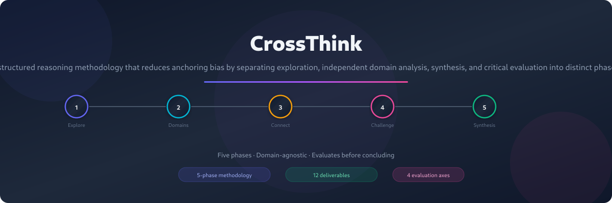
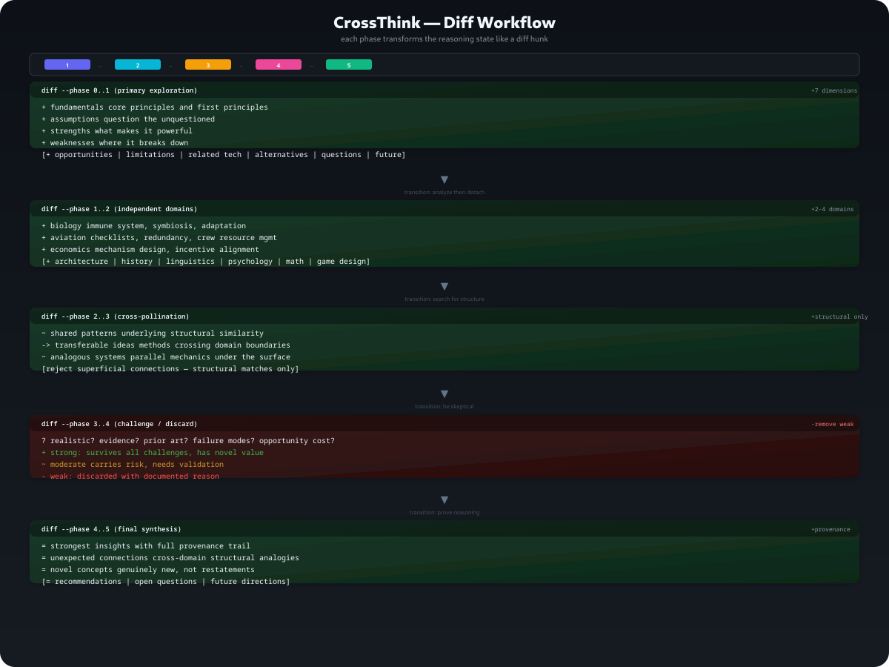

# CrossThink

[](LICENSE)
[](https://github.com/shubh72010/skills-by-JusDots-Devs)
[](/)
[](https://github.com/shubh72010/skills-by-JusDots-Devs/blob/main/SKILL.md)

> **A structured reasoning methodology that reduces anchoring bias by separating exploration, independent domain analysis, synthesis, and critical evaluation into distinct phases.**

CrossThink is not just a brainstorming prompt — it is a **reasoning framework** with phases, failure modes, guardrails, evaluation criteria, and worked examples. It is designed to produce genuinely novel ideas rather than merely expanding on the user's original topic.

<p align="center">
  
</p>

---

## The Problem

Standard brainstorming tends to:

| ❌ Problem | ✅ CrossThink Solution |
|---|---|
| Anchors too quickly on the user's original framing | **Phase 1** explores the topic deeply, then **Phase 2** forces complete detachment and independent domain exploration |
| Produces variations on a single theme | **Phase 3** searches for structural connections to distant domains — not surface-level analogies |
| No critical evaluation before committing | **Phase 4** subjects every idea to realism, evidence, and failure-mode challenges |
| No reproducibility — reasoning is lost | **Phase 5** requires provenance for every major insight |

---

## The Five-Phase Workflow

<p align="center">
  
</p>

Each phase is a diff hunk transforming the reasoning state — additions, deletions, and structural transformations — not a linear checklist.

```diff
diff --phase 0..1  (primary exploration)
+ fundamentals   core principles and first principles
+ assumptions    question the unquestioned
+ strengths      what makes it powerful
+ weaknesses     where it breaks down
+ opportunities  gaps and unmet needs
+ limitations    hard constraints (physical, economic, temporal)
+ related-tech   adjacent methods and technologies
+ alternatives   other ways to solve the same problem
+ unknowns       what remains unanswered
+ future         what would transform this topic
— stop when new ideas become restatements, not new lines of thought

diff --phase 1..2  (independent domains)
+ biology          immune system, symbiosis, adaptation
+ aviation         checklists, redundancy, crew resource mgmt
+ economics        mechanism design, incentive alignment
+ architecture     spatial flow, wayfinding, thresholds
+ history          diffusion, transitions, forgotten ideas
+ linguistics      framing, pragmatics, semantic shift
— detach completely — no referencing phase 1 notes

diff --phase 2..3  (cross-pollination)
~ shared patterns       underlying structural similarity
→ transferable ideas    methods crossing domain boundaries
~ analogous systems     parallel mechanics beneath surface
? hidden assumptions    what the original topic takes for granted
— reject superficial connections — structural matches only

diff --phase 3..4  (challenge / discard)
? realism      achievable given known constraints?
? evidence     anything supporting or contradicting?
? prior-art    has this been attempted? what happened?
? failure-modes    how could this fail specifically?
− weak ideas   discarded with documented justification
+ strong       survives all challenges, generates novel value
~ moderate     carries risk, needs validation

diff --phase 4..5  (final synthesis)
= strongest insights      with full provenance trail
= unexpected connections  cross-domain structural analogies
= novel concepts          genuinely new, not restatements
= recommendations         specific and actionable
= open questions          unanswered, needing investigation
= future directions       where it could go without constraints
```

---

## Quick Start

### OpenCode

```text
/opencode: crossthink Brainstorm browser security
```

### Claude Code

```text
Use the crossthink skill to explore: browser security
```

### Codex

```text
/run crossthink Topic: browser security
```

Any open-ended topic works — technical, scientific, creative, business, or philosophical.

---

## Examples

| Topic | Highlights |
|---|---|
| **[Browser Security](examples/browser-security.md)** | Aviation checklists → structured extension audits; immune system → adaptive "fever mode"; mechanism design → ad-revenue tension as a security vulnerability |
| **[Music Player](examples/music-player.md)** | Architecture spatial design → security zone visualization for tabs; education scaffolding → scaffolded music discovery; manufacturing bottleneck analysis → skip-pattern UX redesign |
| **[Startup Ideas](examples/startup-ideas.md)** | Ecology symbiosis → mutualistic startup partnerships; history diffusion → Global South timing advantage; game design emergence → emergent product architecture |

---

## Before vs. After

**Before** (anchored brainstorming of browser security):

> Use sandboxing, add CSP headers, implement extensions permissions, deploy an ad-blocker, enable safe browsing…
> *All ideas are obvious extensions of the user's existing framing.*

**After** (CrossThink divergent cross-domain):

> Browser extension review should adopt aviation-style structured checklists — proven to reduce human error by 90%+ in high-stakes environments. The immune system model suggests a "security memory" that learns attack patterns. The mechanism design lens reveals an unaddressed tension between ad revenue and security in the browser business model itself.
> *Novel connections that would never emerge from topic-only exploration.*

---

## Design Principles

```
┌─────────────────────────────────────────────────────┐
│  🧠 Separate exploration from evaluation            │
│  🧭 Resist premature connections                   │
│  🎯 Prioritize depth over breadth                  │
│  📐 Choose domains for distance, not relevance     │
│  🔍 Question the question, not just the answer     │
│  💰 Quality over quantity, always                  │
│  🛡️ Every claim requires a reasoning chain         │
└─────────────────────────────────────────────────────┘
```

---

## Project Structure

```text
crossthink/
├── README.md                  ← You are here
├── SKILL.md                   ← Full methodology specification (448 lines)
├── LICENSE                    ← GPL-3.0
├── examples/
│   ├── browser-security.md    ← Worked example: browser security
│   ├── music-player.md        ← Worked example: music player design
│   └── startup-ideas.md       ← Worked example: startup ideation
└── images/
    ├── hero.png               ← Banner image for README
    ├── workflow.png           ← 5-phase workflow diagram
    └── workflow.svg           ← Editable SVG source
```

---

## Specification

The full skill specification is in [`SKILL.md`](SKILL.md). It includes:

- **Skill metadata** — name, description, version, tags, related skills
- **Activation criteria** — when to invoke and when not to
- **Internal reasoning workflow** — transition logs for reproducible reasoning
- **10 best practices** — principles for effective execution
- **8 failure modes** — symptoms, prevention, and detection
- **7 guardrails** — hard constraints that cannot be violated
- **2 worked example conversations** — browser security and music player
- **Full output template** — with all phases, reasoning log, and evaluation checklist

---

## Evaluation Criteria

| Axis | Check |
|---|---|
| **Completeness** | All 5 phases executed in order, none skipped |
| **Quality** | Cross-domain connections are structural, not superficial |
| **Novelty** | At least one idea that would not emerge from topic-only brainstorming |
| **Reproducibility** | Transition log is complete and an independent agent could reconstruct the reasoning chain |

---

## License

[GPL-3.0](LICENSE)

---

## Related

Part of the **[skills-by-JusDots-Devs](https://github.com/shubh72010/skills-by-JusDots-Devs)** hub — a collection of reusable agent skills for specialized reasoning, development workflows, and creative problem-solving.